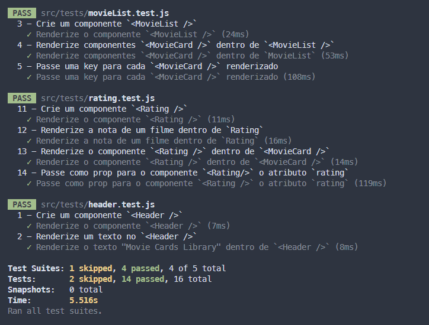

# Movie Cards Library

Uma biblioteca de cartões de filmes utilizando React. A biblioteca possui um cabeçalho e uma lista de cartões. Cada cartão representa um filme e possui uma imagem, título, subtítulo, sinopse e avaliação.

# 🔖 Sumário

- [🚀 Começando](#começando)
- [📋 Pré-requisitos](#pré-requisitos)
- [🔧 Instalação](#instalação)
- [⚙️ Executando os testes](#executando-os-testes)
- [🛠️ Construído com](#construído-com)
- [🎥 Imagens](#imagens)
- [📌 Versão](#versão)

<div id='começando'/> 

## 🚀 Começando

Essas instruções permitirão que você obtenha uma cópia do projeto em operação na sua máquina local para fins de desenvolvimento e teste.

No terminal , clone o repositório:

```sh
git clone git@github.com:Raph2ll/Movie-Cards-Library.git
```

<div id='pré-requisitos'/>

### 📋 Pré-requisitos

Você ira precisar dessas tecnologias na sua máquina.

```
[Javascript, NPM, Node.js, Git e GitHub]
```

<div id='instalação'/>

### 🔧 Instalação

Após baixar o repositório você vai precisar.

1. Entrar na pasta do repositório clonado:

```sh
cd Movie-Cards-Library
```

2. Instale e inicialize a aplicação:

```sh
npm install && npm start
```

3. Agora é só entrar no endereço do local host:

```sh
http://localhost:3000
```

<div id='executando-os-testes'/> 

## ⚙️ Executando os testes

### 🔩 Analise os testes de ponta a ponta

Esses testes foram feitos para os elementos visuais da página.

Para executar os testes basta seguir os passos.

1. Entrar na pasta do projeto:

```sh
cd Movie-Cards-Library
```

2. Inicializar os testes:

```sh
npm test
```

<div id='construído-com'/>

## 🛠️ Construído com

Ferramentas utilizadas para criar o projeto:

- **Linguagem:** 
  - [JavaScript](https://www.javascript.com)

 - **Frontend**: 
    - [React.Js](https://pt-br.reactjs.org) - Framework Web

<div id='imagens'/>

## 🎥 Imagens

### Imagens do projeto 


>  Imagem do projeto.



> Imagem dos testes.

<div id='versão'/>

## 📌 Versão

Utilizei [NPM](https://www.npmjs.com) :package: para controle de versão das dependências.

---
⌨️ com ❤️ por [Raphael](https://gist.github.com/Raph2ll)
